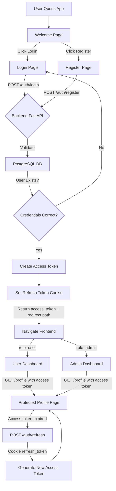

# ⭐ SweetTreatLogin — Full Authentication System

A modern full-stack authentication system built using **FastAPI**, **React**, **JWT Access Tokens**, **HTTP-Only Refresh Cookies**, and **PostgreSQL**.

It includes:

* User & Admin Registration
* Login with JWT
* Refresh Token Rotation
* Protected Routes
* Dashboards
* Aurora-themed UI Pages
* Fully modular backend architecture
* Frontend–backend integration

---

## 📌 Features

### 🔐 Authentication

* Email + password login
* Hashed passwords (bcrypt + passlib)
* JWT Access Token
* HttpOnly Refresh Token cookie
* Auto-refresh workflow
* Role-based redirects (user/admin)

### 🎨 Frontend

* Modern Aurora UI with Tailwind
* Welcome page
* Login page
* Register page
* Profile page
* Protected routes with access token check

### 🗄 Backend

* FastAPI
* Organized routing structure
* Pydantic models
* Custom JWT creator module
* Custom hashing module
* Cookie security options

### 🛢 Database

* PostgreSQL
* Separate user/admin tables
* Repository pattern

---

## 🏗 Project Architecture (Diagram)



---

## ⚙️ Tech Stack

### **Frontend**

* React + Vite
* React Router
* TailwindCSS
* Axios

### **Backend**

* FastAPI
* Pydantic
* Passlib + bcrypt
* jose/jwt
* PostgreSQL
* CORS Middleware

---

## 📂 Folder Structure

```
root
│
├── backend
│   ├── app
│   │   ├── main.py
│   │   ├── jwt_creator.py
│   │   ├── hashing.py
│   │   ├── security.py
│   │   ├── db.py
│   │   ├── models_schema.py
│   │   ├── tests
│   │   └── ...
│   └── requirements.txt
│
└── frontend
    ├── src
    │   ├── pages
    │   │   ├── WelcomePage.jsx
    │   │   ├── LoginPage.jsx
    │   │   ├── RegisterPage.jsx
    │   │   └── ProfilePage.jsx
    │   ├── components
    │   │   └── Aurora.jsx
    │   ├── api
    │   │   └── api.js
    │   └── main.jsx
    └── package.json
```

---

## 🚀 Installation Guide

### 1️⃣ Backend Setup

#### **Create virtual environment**

```bash
cd backend
python -m venv venv
source venv/bin/activate  # Windows: venv\Scripts\activate
```

#### **Install dependencies**

```bash
pip install -r requirements.txt
```

#### **Run server**

```bash
uvicorn app.main:app --reload
```

Backend runs at:
👉 [http://127.0.0.1:8000](http://127.0.0.1:8000)

---

### 2️⃣ Frontend Setup

```bash
cd frontend
npm install
npm run dev
```

Frontend runs at:
👉 [http://localhost:5173](http://localhost:5173)

---

## 🔁 Authentication Flow (Detailed)

### 1. **User Logs In**

Frontend → POST `/auth/login`

Backend:
* Validates credentials
* Creates access token
* Creates refresh token (HttpOnly cookie)

Response:

```json
{
  "access_token": "...",
  "redirect": "/dashboard/user"
}
```

### 2. **Frontend Stores Access Token**

```js
localStorage.setItem("access_token", access_token);
```

### 3. **Protected API Calls**

Frontend includes:

```
Authorization: Bearer <access_token>
```

### 4. **If access token expired**

Frontend → `/auth/refresh`

Backend checks:
* refresh_token cookie
* returns new access token

---

## 🔌 Testing Endpoints (curl)

### Register

```bash
curl -X POST http://127.0.0.1:8000/auth/register \
-H "Content-Type: application/json" \
-d '{"id":1,"username":"john","email":"john@test.com","password":"1234"}'
```

### Login

```bash
curl -X POST http://127.0.0.1:8000/auth/login \
-d "username=john@test.com&password=1234"
```

---

## 🛠 Troubleshooting

### **❌ OAuth2 Login → 422 Unprocessable Entity**

Fix: Use form-data, not JSON

### **❌ Tailwind not recognized**

Run:

```bash
npm install -D tailwindcss postcss autoprefixer
npx tailwindcss init -p
```

### **❌ bcrypt "about" missing**

Install compatible version:

```bash
pip install bcrypt==4.0.1
```

---

## 🧭 Future Improvements

* Two-factor authentication
* Token revocation table
* Rate limiting
* Google OAuth login
* User upload avatar
* Admin dashboard with charts

---

## 📄 License

MIT License — feel free to use it for personal or commercial projects.

---

## 🤝 Contributing

Contributions are welcome! Please feel free to submit a Pull Request.

---

## 📧 Contact

For questions or suggestions, please open an issue on GitHub.
